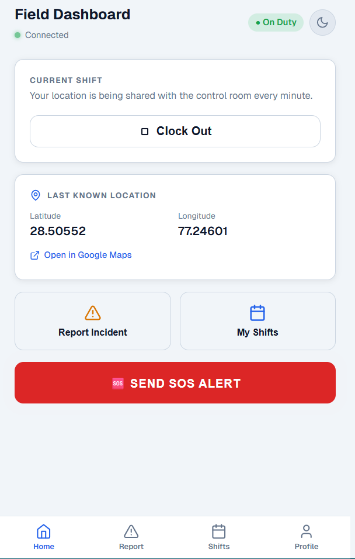
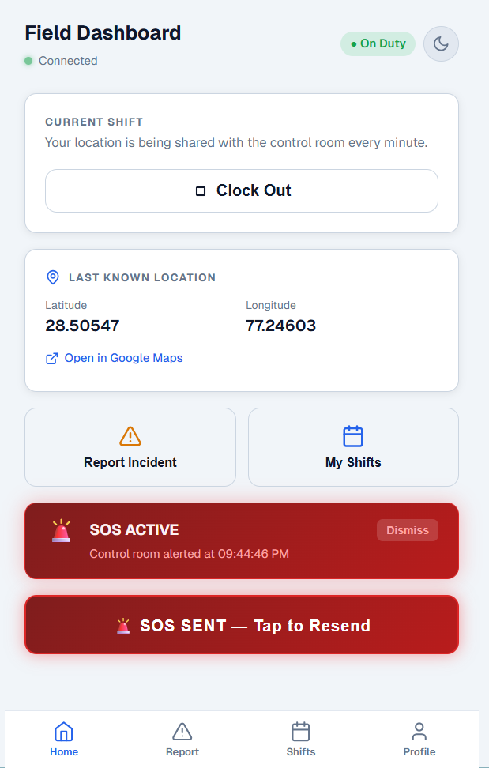
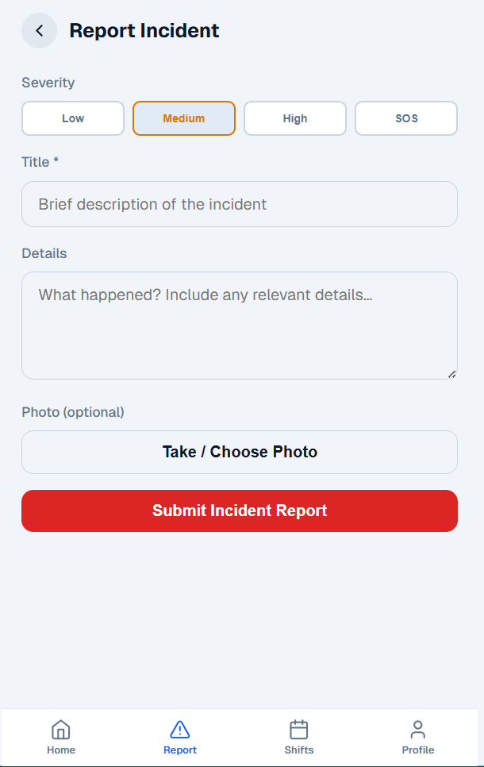
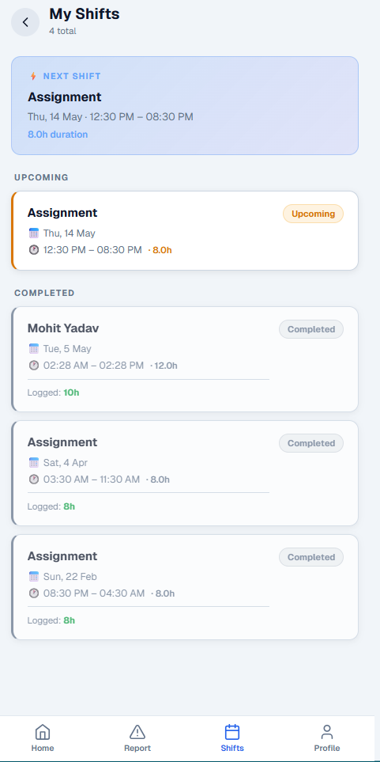
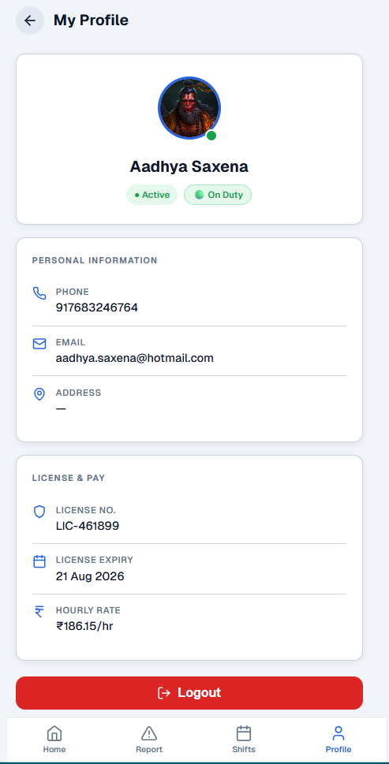

# Garud Kavach - Field Guard PWA


## 📋 Overview

The **Garud Kavach Guard App** is a Progressive Web Application (PWA) designed specifically for field security personnel. It acts as the mobile counterpart to the Garud Kavach enterprise platform, allowing guards to clock in/out, report incidents with photos, manage their shift schedules, and send real-time SOS alerts. 

Powered by WebSockets, it continuously shares the guard's live location with the Control Room (Super Admin dashboard) when on duty.

### 🖼️ App Screens

<table align="center">
  <tr>
    <td></td>
    <td></td>
    <td></td>
  </tr>
  <tr>
    <td></td>
    <td></td>
    <td></td>
  </tr>
</table>

## ✨ Features

### 📡 Real-Time Field Operations
- **Live Location Tracking**: Automatically pings GPS coordinates to the control room every 60 seconds while clocked in.
- **Instant SOS Alerts**: One-tap emergency SOS button that immediately alerts the dispatcher/control room.
- **Clock In / Out**: Simple toggle to start and end active shifts, instantly updating status across the platform.

### 📋 Reporting & Schedules
- **Incident Reporting**: Structured reporting with severity levels (Low, Medium, High, SOS) and built-in photo capture & compression.
- **Shift Management**: View upcoming assigned shifts and review a history of completed shifts and logged hours.
- **Profile & License Info**: Easy access to active assignments, contact info, hourly rates, and license expiry dates.

### 📱 Progressive Web App (PWA)
- **Installable**: Can be installed directly to the home screen on iOS and Android bypassing App Stores.
- **Offline Resilience**: Service workers cache assets for faster loading in poor network areas.
- **Dark/Light Themes**: Accessible UI with built-in theme toggling for day and night patrols.
- **Token-based Auth**: Secure login via unique Guard License keys.

## 🧰 Technology Stack

- **Frontend Framework**: React 19
- **Build Tool**: Vite 6.0
- **PWA Support**: `vite-plugin-pwa`
- **Real-Time Data**: Native WebSockets (`ws://`) connecting directly to the Go Backend
- **Image Handling**: `browser-image-compression` for optimized mobile uploads
- **Styling**: Vanilla CSS / CSS Modules optimized for mobile viewports

## 🚀 Installation

```bash
# Clone the repository
git clone https://github.com/ayushsingh-22/Garud-Kavach-Guard.git
cd Garud-Kavach-Guard

# Install dependencies
npm install

# Start the development server
npm run dev
```

To test the application locally, ensure the main **Garud-Kavach-Server** is running and configured correctly in your `.env` file for API & WebSocket URLs.

## 🔌 Integration with Server

The app connects to the main Garud Kavach Go Server:
- **REST API (`/api/guards/*`)**: Fetches shifts, profile details, and submits incident reports.
- **WebSocket (`/ws/guard?license=...`)**: Maintains a persistent connection for real-time duty tracking and SOS broadcasting.

## 🔒 Security

- **License Key Auth**: Guards authenticate using their unique government-issued or company-issued license number.
- **Location Privacy**: Location tracking is strictly enforced *only* when the guard is clocked in ("On Duty").
- **Disconnect Handling**: Connection drops are gracefully handled with automatic WebSocket reconnects.

## 📝 License

This project is licensed under the MIT License - see the LICENSE file for details.
